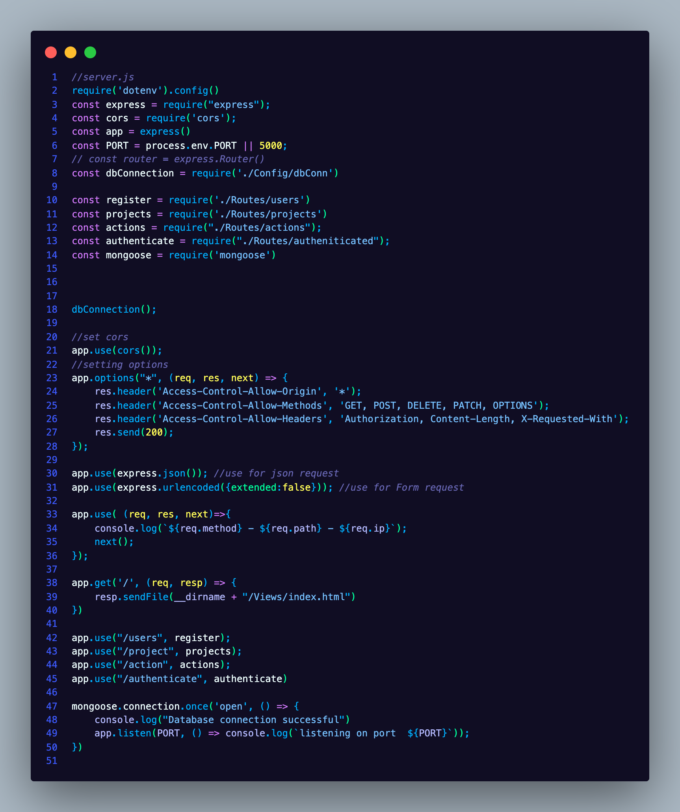
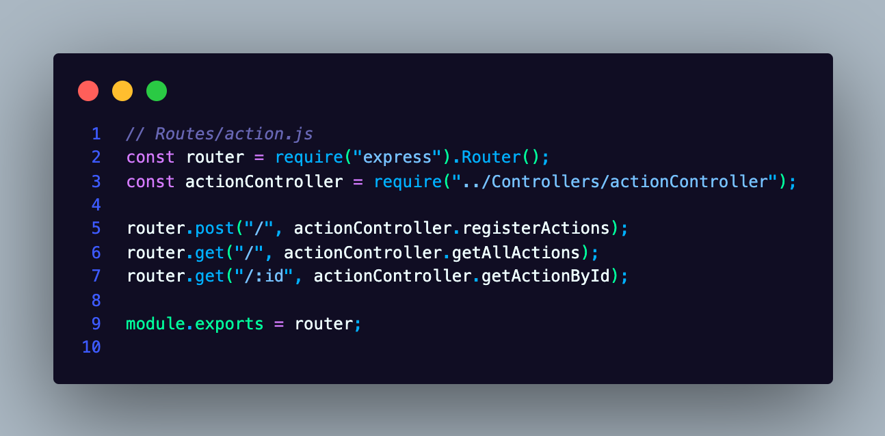
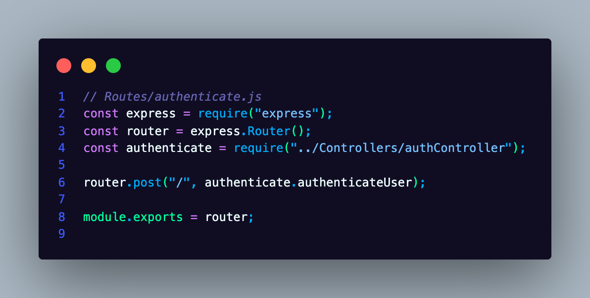
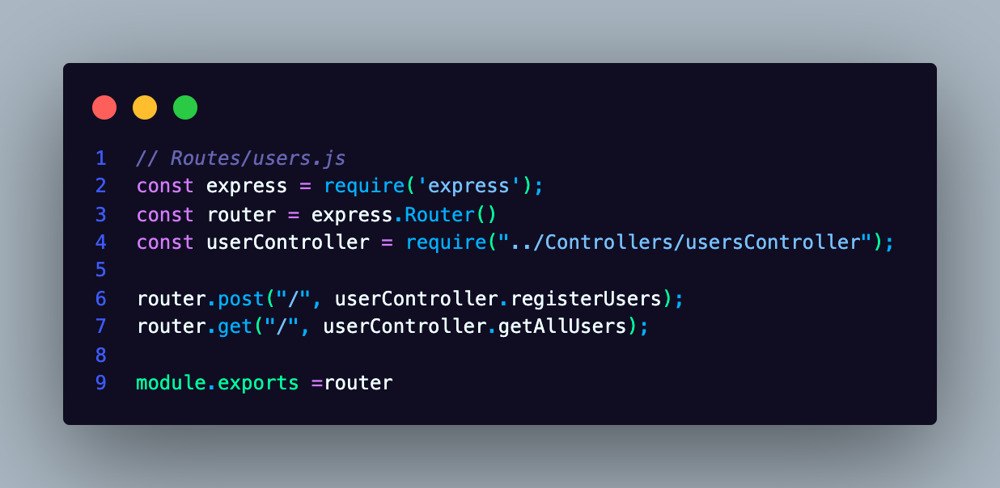
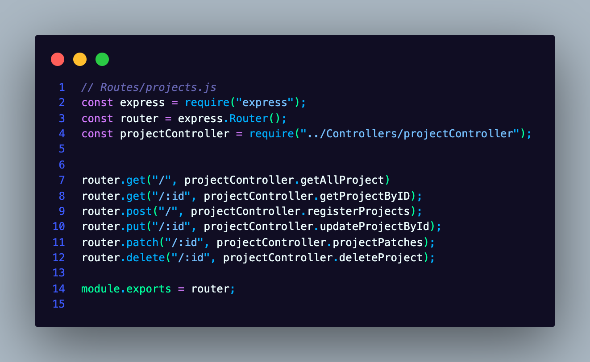

# NodeVGG

### This is a node version of the VGG, you can get the original python version [HERE](https://github.com/garantor/flaskVGG) on github
# FLASK API CHALLENGE VGG

---

## This is an API created using Node, Express with MongoDB to manage Projects and Actions
> Challenge Description:
> In this challenge, you design and create a web API to manage the following
> resources: Projects and Actions.

---

# FEATURES
* A model for Users, Projects, and Actions
* Create Users using a POST request
* Create a Project Using a POST Request
* Create Actions using a POST Request
* Authenticate users and generate a token
* Get all Projects Using a GET Request
* Get a project by id
* Update an existing project using a PUT Request
* Update property of a particular project using PATCH
* Delete a project using DELETE
* Create actions using POST
* Get the list of all Actions using GET
* Get a single action by its ID
* Delete an action that belongs to a project using action ID

---
# USAGE
```
git clone https://github.com/garantor/NodeVGG.git
cd NodeVGG
npm install
npm run dev
```
You should have the api running on port 5000, the "/" endpoint gives you details about the API and the endpoints available

# SCREENSHOTS





